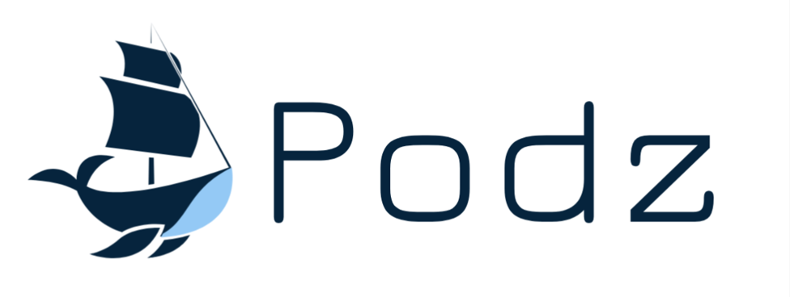

<div align='center'>

[](https://www.javascript.com/)
[](https://www.typescriptlang.org/)
[](https://react.dev/)
[](https://nodejs.org/en)
[](https://expressjs.com/)
[](https://www.docker.com/)
[](https://kubernetes.io/)
[](https://www.mongodb.com/)


[](https://d3js.org/)
[](https://jestjs.io/)
[](https://www.electronjs.org/)
[](https://jestjs.io/)

</div>

<p align="center">
Podz is a Kubernetes cluster visualizer for developers to see the metrics of their cluster.<br/>Find out more at <a href="http://www.podz.site/" target="_blank">podz.site</a>!
</p>

## Table of Contents

- 🚀 [Features](#features)
- 📒 [Getting Started](#getting-started)
- 🧰 [Examples](#examples)
- 🛠 [Roadmap](#roadmap)
- 🔗 [Contributions](#contributions)
- 🙆 [Founders](#founders)

## Features:

<div align="center">
  
</div>

- Podz, an open-source Kubernetes dev tool, is designed to assist developers in visualizing the architecture of their Kubernetes clusters
- Our web-based GUI enables users of any operating system running a local Kubernetes cluster to effortlessly showcase and visualize their cluster
- With a single click, our platform easily retrieves, stores, and presents comprehensive cluster architecture along with health metrics for each node, pod, container, and service.
- You can view previous metrics with the use of snapshots.
- Included is an example project for users to test and explore Podz, allowing them to try out its features firsthand.

## Getting Started

#### Prequisites:

- Docker Desktop (`https://www.docker.com/products/docker-desktop/`)
- kubectl (`https://kubernetes.io/docs/tasks/tools/`)
- Minikube (optional) (`https://minikube.sigs.k8s.io/docs/start/`).

<strong style="color: red">Podz displays only user-made Kubernetes components and avoids the initial namespaces except 'default' ('kube-node-lease', 'kube-public', 'kube-system' are all hidden). If you need example projects, we have provided some in the [examples](#examples) section.</strong>

### Using Minikube:

For testing purposes Podz, we highly recommend the usage of [Minikube](https://minikube.sigs.k8s.io/docs/start/), which uses a minimal local Kubernetes cluster.
To use Minikube with Podz, start Minikube with this command:

```js
minikube start --extra-config apiserver.cors-allowed-origins=["http://*”]
```

What this command does is start up minikube and prevent CORS blocking the connection between the Kubernetes API Server and the Podz website.
Next, you will need to expose the Kubernetes API Server through proxying for HTTP requests, to do this run the command:

```js
kubectl proxy --port=<number>;
```

This can be any port of your choice, so long as you change the Podz website’s port to match it.

### Using Standalone Kubernetes:

For standalone Kubernetes, first disable CORS blocking of [http://] requests in the Kuberenetes API Server's configuration.
Next, run the command:

```js
kubectl proxy --port=<number>
```

This can be any port of your choice, so long as you change the Podz website’s port to match it.

### Conecting a database:

Currently, Podz is able to be connected to a MongoDb database to store snapshots of the cluster health and architecture at given points of time. To connect a database, copy and paste your MongoDb connection link into the field on the "demo" page. Next enter the port that you are proxying and confirm.

### Creating and loading snapshots:

To create a snapshot, simply to click the 'Take Snasphot' button. To load snapshots, select a time range with the calendar component, and then click the 'Load Snapshot' button. The button will open a dropdown with all snapshots taken within that range of time, ordered by time. Finally, click one of the options and the snapshot will load a previous version of the cluster.

## Examples

### Setting up minikube

While you are following the steps, you may encounter an error mentioning about default not being found. You can run this command to fix it:

```js
docker context use default
```

For testing purposes Podz, we highly recommend the usage of Minikube, which uses a minimal local Kubernetes cluster. To use Minikube with Podz, start Minikube with this command:

```js
minikube start
```

What the following command does is start up minikube and prevent CORS blocking the connection between the Kubernetes API Server and the Podz website.

```js
minikube start --extra-config apiserver.cors-allowed-origins=["http://*”]
```


In the `test-project` folder, you can use those project examples to store in your containers. Next, `cd` to the test project folder and run the command:

```js
docker-compose build
```

Now, you have 3 containers set up and you should be able to see 3 images in your Docker desktop!

After that is done, check if Minikube is created and started up with this command:

```js
kubectl get all
```

Next, you need to load the images into Minikube. To do that, run this command:

```js
minikube image load <image name:version>
```
*At the moment, Minikube does not load images with the newest version of Docker. As of now, please download Docker version 24.0.7* =

`image name` needs to be replaced by the name of the image and `version` needs to be the tag of the image. Check Docker Desktop to find the image name and tags.

Now, you need to apply all `.yaml` files to kubectl by running this command:

```js
kubectl apply -f <.yml file name>
```

Next, you will need to expose the Kubernetes API Server through proxying for HTTP requests, to do this run the command:

```js
kubectl proxy --port=<number>
```

This can be any port of your choice, so long as you change the Podz website’s port to match it.

## Roadmap

- Fully converting to TypeScript
- Testings for frontend
- Loading clusters in the correct position like a binary search tree
- Notification alerts
- Live reloading of cluster
- More metrics like CPU, memory, etc.
- Visualizer for Docker containers

## Contributions

The open-source community is awesome because of contributors like you. Your contributions are invaluable!

If you have a suggestion, fork the repo and make a pull request. You can also open an issue to discuss your idea. And, don't forget to give the project a star! Thanks!

1. Fork the Project
2. Create your Feature Branch (`git checkout -b feature/AmazingFeature`)
3. Commit your Changes (`git commit -m 'Add some AmazingFeature'`)
4. Push to the Branch (`git push origin feature/AmazingFeature`)
5. Open a Pull Request

## Founders

- Bin Zheng [Github](https://github.com/binzheng622) | [LinkedIn](https://www.linkedin.com/in/bin-zheng-b912532a/)
- Ezekiel Mohr [Github](https://github.com/Ezmr7) | [LinkedIn](https://www.linkedin.com/in/ezekielmohr/)
- Jeffrey Mai [Github](https://github.com/jeffrey-mai) | [LinkedIn](https://www.linkedin.com/in/jeffrey-mai-fiv/)
- Philip Wang [Github](https://github.com/pwang10) | [LinkedIn](https://www.linkedin.com/in/philipwang1/)
